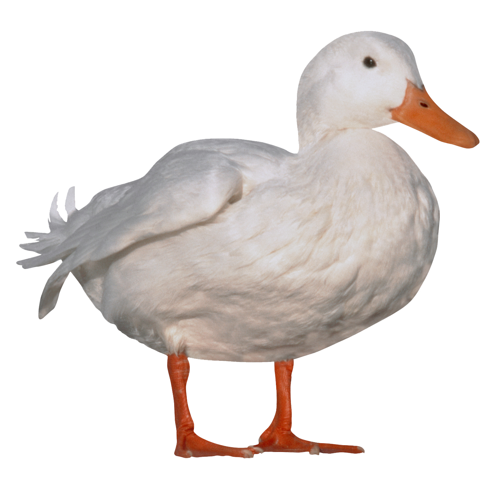

# pensamiento-computacional-sec6
ejercicios y entregas códigos para curso 

## Primer ejercicio de codigo

**negrita**
*italica*

- esto
- es
- una lista

- [link](https://levanova.es/receta-de-pan-rustico/)

 

 
